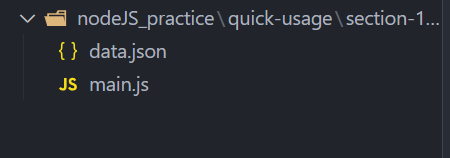
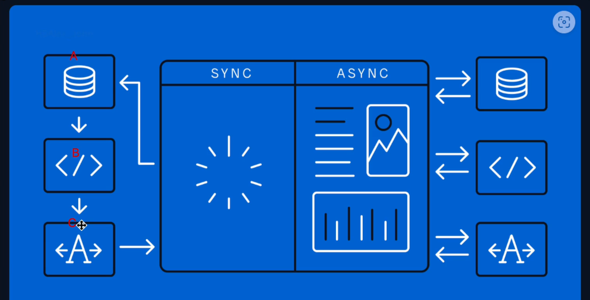
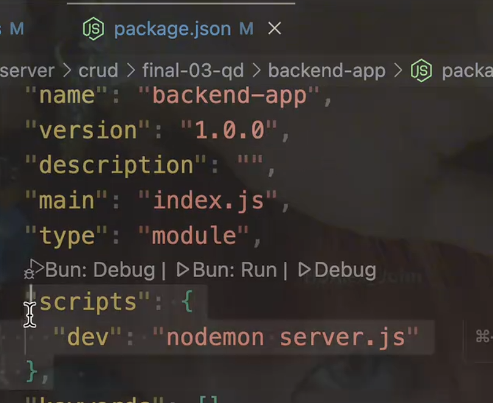
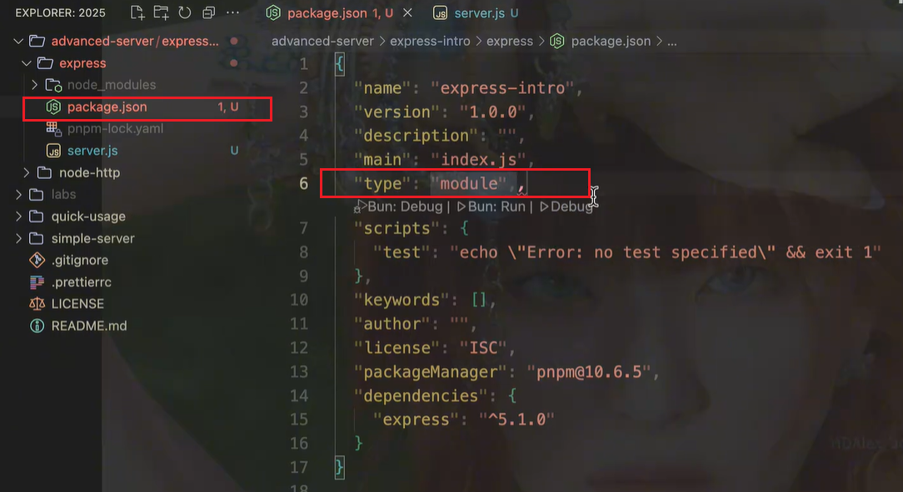
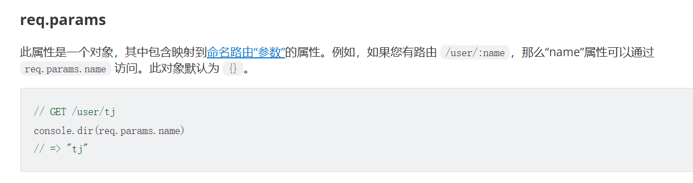
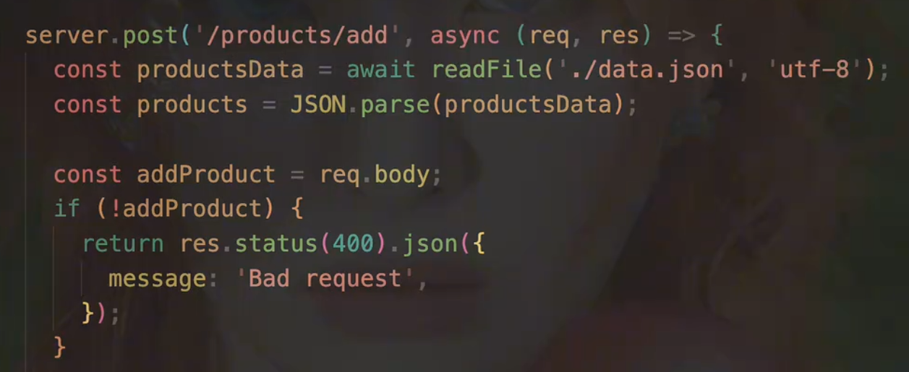
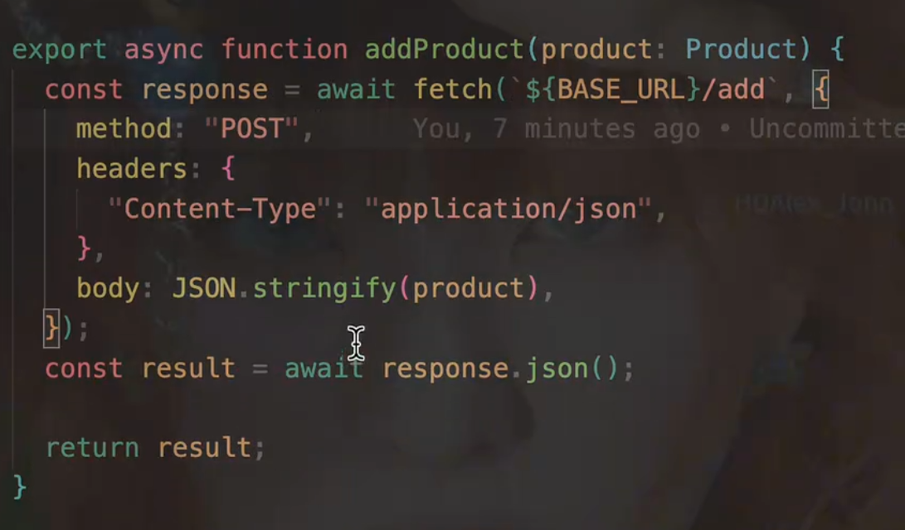
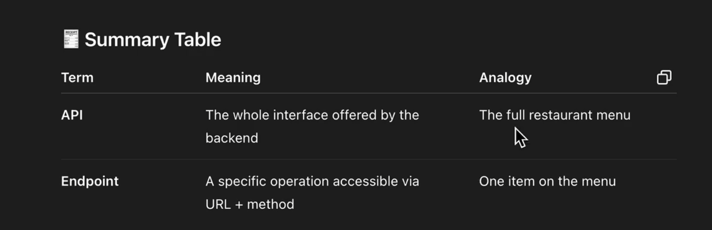
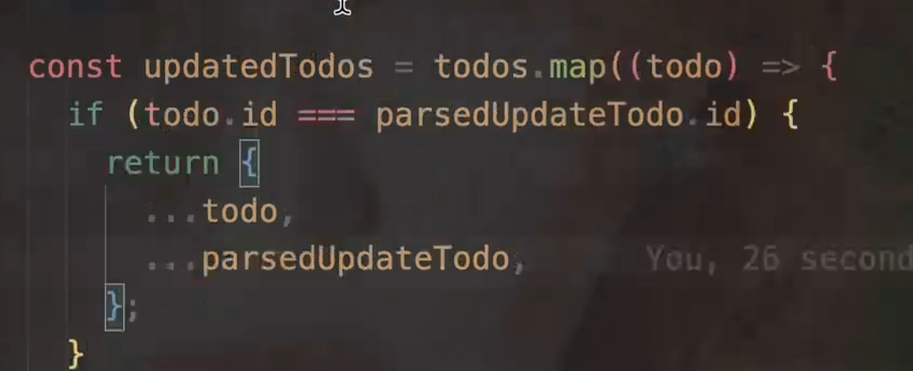

# nodeJS学习笔记

## 读写文件的方法

```javascript
import { readFile, writeFile, appendFile } from 'node:fs/promises';

const data = await readFile('./data.json', 'utf8');

// await writeFile("./data.json", "alex-john", "utf8");

await appendFile('./data.json', 'alex-john', 'utf8');

console.log(data);
```

在终端运行文件： node  main.js



## 同步和异步的区别




**异步函数就是指返回值为Promise对象的函数**


CommonJS是同步加载模组，ES为异步加载模组。为了浏览器的兼容性和代码性能，之后都是用ES异步写法

### CommonJS 与 ES 模块（ESM）的区别

| **对比维度**     | **CommonJS**                                | **ES 模块（ESM）**                                         |
| ---------------- | ------------------------------------------- | ---------------------------------------------------------- |
| **模块规范类型** | 用于 Node.js 等服务端环境的模块化规范       | 浏览器和现代 JavaScript 环境的官方模块化规范               |
| **导出方式**     | 使用`module.exports`或`exports`导出         | 使用`export`（具名导出）或`export default`（默认导出）     |
| **导入方式**     | 使用`require()`同步导入                     | 使用`import`（支持静态导入、动态`import()`）               |
| **加载时机**     | 运行时加载（执行到`require`时才加载模块）   | 编译时加载（静态分析，在代码执行前就确定依赖）             |
| **动态特性**     | 支持动态引入（如根据条件`require`不同模块） | 静态导入不支持动态逻辑，动态`import()`可实现但返回 Promise |
| **循环依赖处理** | 运行时处理，可能出现未预期的状态            | 编译时处理，通过 “暂存死区” 等机制更可靠                   |
| **应用场景**     | 主要用于 Node.js 服务端开发                 | 浏览器前端开发、现代 Node.js（支持 ESM）、跨端项目         |

**补充说明**：

- CommonJS 是 Node.js 早期的模块化方案，而 ES 模块是 ECMAScript 官方标准，通用性更强。
- 现代 Node.js 已支持 ES 模块（需通过`package.json`的`"type": "module"`声明或`.mjs`文件后缀启用），可在服务端和前端统一使用 ES 模块规范。


## 如何修改 npm 为 pnpm

检查当前 npm 的版本

```
npm -v
```

更改 npm 的镜像源

```
npm config set registry https://registry.npmmirror.com

# 检验是否成功的代码
npm config get registry
# 输出应为：https://registry.npmmirror.com
```

全局安装 pnpm

```
npm install pnpm -g

pnpm -v
```

### npm和pnpm的区别

| 功能          | npm 命令            | pnpm 命令          | 备注                        |
| ------------- | ------------------- | ------------------ | --------------------------- |
| 添加依赖      | `npm install xxx`   | `pnpm add xxx`     | pnpm 推荐用 add             |
| 移除依赖      | `npm uninstall xxx` | `pnpm remove xxx`  | pnpm 用 remove              |
| 初始化项目    | `npm init`          | `pnpm init`        | 一致                        |
| 安装全部依赖  | `npm install`       | `pnpm install`     | 一致                        |
| 运行脚本      | `npm run xxx`       | `pnpm run xxx`     | 一致                        |
| 清理缓存      | `npm cache clean`   | `pnpm store prune` | 不同命令不同作用            |
| monorepo 过滤 | 无                  | `pnpm --filter`    | pnpm 对 monorepo 支持更友好 |

## 全局安装nodemon

pnpm add -g nodemon

```
查看全局安装的包
pnpm list -g
```



之后package.json文件中的scripts如图配置


## 响应状态码

200  响应成功

400 请求参数有问题

404 找不到相应的内容


## express

25年之后使用的node版本要大于20，不然很多功能无法正常使用

**以下代码以 pnpm 为例**

```js
初始化项目
pnpm init

安装 express
pnpm add express
```

注意：

package.json 文件中需要添加一行代码： "type": "module"



### req.params

路由路径和参数

参数为下图中的 :name



此属性是一个对象，其中包含映射到[命名路由“参数”](https://express.js.cn/en/guide/routing.html#route-parameters)的属性。例如，如果您有路由 `/user/:name`，那么“name”属性可以通过 `req.params.name` 访问。此对象默认为 `{}`。

```javascript
// GET /user/tj
console.dir(req.params.name)
// => "tj"
```


### res.json

发送 JSON 响应。此方法发送一个响应（带有正确的内容类型），该响应是使用 [JSON.stringify()](https://mdn.org.cn/en-US/docs/Web/JavaScript/Reference/Global_Objects/JSON/stringify) 将参数转换为 JSON 字符串后的结果。

参数可以是任何 JSON 类型，包括对象、数组、字符串、布尔值、数字或 null，你也可以用它来将其他值转换为 JSON。

```js
res.json(null)
res.json({ user: 'tobi' })
res.status(500).json({ error: 'message' })
```

### cors 中间件

解决跨域请求的问题

```js
var express = require('express')
var cors = require('cors')
var app = express()

app.use(cors())

app.get('/products/:id', function (req, res, next) {
  res.json({msg: 'This is CORS-enabled for all origins!'})
})

app.listen(80, function () {
  console.log('CORS-enabled web server listening on port 80')
})
```

### express.json() 中间件

想要通过req.body添加数据时，需要使用 express.json() 中间件

```js
const express = require('express')

const app = express()

app.use(express.json()) // for parsing application/json
app.use(express.urlencoded({ extended: true })) // for parsing application/x-www-form-urlencoded

app.post('/profile', (req, res, next) => {
  console.log(req.body)
  res.json(req.body)
})
```


## http请求方法

### get

请求到的数据都从地址栏中获取

增删改查都可以使用get方法，但是新增内容有文本限制，超出就会报错

```javascript
app.get('/todos', async (_req, res) => {
  const todosData = await readFile('./data.json', 'utf-8');
  const todos = JSON.parse(todosData);

  return res.status(200).json(todos);
});
```

### post

想要通过req.body添加数据时，需要使用 express.json() 中间件

```js
const express = require('express')

const app = express()

app.use(express.json()) // for parsing application/json
app.use(express.urlencoded({ extended: true })) // for parsing application/x-www-form-urlencoded

app.post('/profile', (req, res, next) => {
  console.log(req.body)
  res.json(req.body)
})
```

后端代码：



前端代码react：




### 端点

endpoint 端点



API是“菜单”，endpoint是“菜单”上的每一道菜


### 端口

port 端口


## http请求方法

### get

请求到的数据都从地址栏中获取

增删改查都可以使用get方法，但是新增内容有文本限制，超出就会报错

```javascript
app.get('/todos', async (_req, res) => {
  const todosData = await readFile('./data.json', 'utf-8');
  const todos = JSON.parse(todosData);

  return res.status(200).json(todos);
});
```

### post

想要通过req.body添加数据时，需要使用 express.json() 中间件

```js
const express = require('express')

const app = express()

app.use(express.json()) // for parsing application/json
app.use(express.urlencoded({ extended: true })) // for parsing application/x-www-form-urlencoded

app.post('/profile', (req, res, next) => {
  console.log(req.body)
  res.json(req.body)
})
```

后端代码：


前端代码react：


### 端点

endpoint 端点


API是“菜单”，endpoint是“菜单”上的每一道菜


### 端口

port 端口


## 扩展运算符




## 扩展运算符


# env配置文件

如何使用.env配置文件

需要通过安装包  pnpm add @dotenvx/dotenvx

之后再package.json 文件中添加如下代码：

```
"scripts": {
    "dev": "dotenvx run -- node server.js"
  },
```

# sequelize

`sequelize` 是一个基于 Node.js 的 ORM（对象关系映射）工具，它允许你通过 JavaScript/TypeScript 代码操作关系型数据库（如 MySQL、PostgreSQL、SQLite、MSSQL 等），无需直接编写 SQL 语句，而是通过面向对象的方式操作数据。

pnpm add sequelize

pnpm add pg pg-hstore


